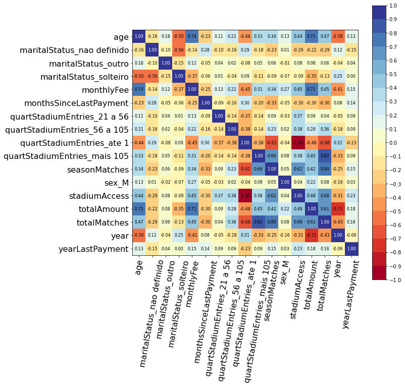

# Customer dropout membership :technologist: :moneybag: :chart_with_upwards_trend:

Context:
An organization membership located in Portugal. The organization offers an annual membership
for the members, the service subscription has several payment options:

- Men with a annual fee of 10€
- Women annual fee of 6€
- Correspondent fee 6€
- Retired fee 5€
- Student fee 2.5€
- under-14 fee 1€

# Methodology

In this study, we adopt random survival forests which have never been used in understanding 
factors affecting membership in a sport club using existing data in a Sport Club. 
The analysis is based on the use of random survival forests in the presence of covariates 
that do not necessarily satisfy the PH assumption. 
Random Survival Forests does not make the proportional hazards assumption [@Ehrlinger_2016] 
and has the flexibility to model survivor curves that are of dissimilar shapes for 
contrasting groups of subjects. Random Survival Forest is an extension of Random Forest 
allowing efficient non-parametric analysis of time to event data [@Breiman_2001].
This characteristics allow us to surpass the Cox Regression limitation of the proportional hazard
assumption, requiring to exclude variables which not fulfill the model assumption. 
It was shown by @Breiman_2001 that ensemble learning can be further improved by injecting 
randomization into the base learning process - a method called Random Forests.  
The random survival forest was developed using the package PySurvival [@Fotso_others_2019].
The most relevant variables predicting the dropout are analysed using the log-rank test. 
The metric variables are transformed to categorical using the quartiles to provide a statistical
comparison of groups. 
The survival analysis was conducted using the package Lifelines [@Davidson-Pilon_2021].

# Packages installation

PySurvival is an open source python package for Survival Analysis modeling - the modeling concept used to analyze or predict when an event is likely to happen. It is built upon the most commonly used machine learning packages such NumPy, SciPy and PyTorch.
PySurvival is compatible with Python 2.7-3.7

```
# create environment with python 3.7
conda create --name survival python=3.7
# activate environment
conda activate survival
# package essentials
conda install -c conda-forge jupyter
conda install -c conda-forge jupyterlab
conda install -c conda-forge xlrd
conda install -c conda-forge openpyxl
conda install -c conda-forge lifelines
# install PySurvival dependencies
conda install -c conda-forge numpy
conda install -c conda-forge scipy
conda install -c conda-forge scikit-learn
conda install -c conda-forge pytorch

# install c++ dependencies
sudo apt install gcc-8 g++-8
# edit .bashrc or .zshrc according the terminal used then source
# e.g. source ~/.zshrc
export CXX=/usr/bin/g++-8
export CC=/usr/bin/gcc-8
# install pysurvival after dependencies are resolved by conda
pip install pysurvival
```

Windows installation requires some changes.
Followed this [link](https://github.com/square/pysurvival/issues/8).
Install visual studio build tools [here](https://aka.ms/buildtools)


```python
git clone https://github.com/bacalfa/pysurvival.git
python setup.py build_ext --inplace
python setup.py install --user
```

some problems with numpy: pip install numpy==1.19.3

```
@Misc{ pysurvival_cite,
  author = {Stephane Fotso and others},
  title = {{PySurvival}: Open source package for Survival Analysis modeling},
  year = {2019--},
  url = "https://www.pysurvival.io/"
}
```

# Installing in reticulate 


## Windows

There are some issues related to windows installation this tries to 
address that:

```python
conda_create(envname = "rsurvival",
             conda="C:/Users/sobre/AppData/Local/r-miniconda/Scripts/conda.exe",
             forge = TRUE, 
             channel = c("conda-forge","sebp"), 
             packages = c("pandas","seaborn","lifelines","scikit-survival"),
             python_version = "3.7.10")

then install pysurvival using conda environment

conda activate rsurvival

git clone https:/github.com/bacalfa/pysurvival.git
python setup.py build_ext --inplace
python setup.py install --user
```

```{python Py,eval=TRUE,echo=TRUE}
from pysurvival.utils.display import correlation_matrix
import pandas as pd

# some problems in linux need to add openpyxl to read excel file
df = pd.read_excel('../data/membershipData.xlsx',index_col=0,engine = 'openpyxl')

correlation_matrix(df, figure_size=(10,10), text_fontsize=8)
print('olá mundo')
```


# Running the model

```
from pysurvival.utils.display import correlation_matrix
correlation_matrix(df[features], figure_size=(10,10), text_fontsize=8)
```



## Removed the variables with greater correlations 

```
to_remove = ['totalJogos', 'idaEstadio']
features = np.setdiff1d(features, to_remove).tolist()
```

## Model building

The model was built with with 60% of the data for training and 40% for testing.
The survival model parameters where:

```
from pysurvival.models.survival_forest import RandomSurvivalForestModel
csf = RandomSurvivalForestModel(num_trees=200)
csf.fit(X_train, T_train, E_train, max_features='sqrt', max_depth=5, min_node_size=20)
```

The model accuracy is very high in the first years. The prediction is very similar
to the actual value.


All the outputs are available [here](./analysis/01.survRandomForest.pdf)


# Article Ascarza

- Retention Futility: Targeting High-Risk Customers Might be Ineffective [@ascarza_retention_2018]

Ascarza, E. (2018). Retention Futility: Targeting High-Risk Customers Might be Ineffective. Journal of Marketing Research, 55(1), 80-98. sim. https://doi.org/10.1509/jmr.16.0163


Example of  Developed actions: 

```markdown
Each month, the company identified the customers who were up for renewal and
split them (randomly and evenly) between a treatment group that received a 
"thank you" gift with the letter and a control group that received only the 
renewal latter.
````

# Open questions

\begin{itemize}
    \item RQ1: What is the current state of the research being developed?
    \item RQ2: What algorithms have been used to predict dropout?
    \item RQ3: What are the features used to predict dropout?
    \item RQ4: When does dropout occur?
    \item RQ5: How is the accuracy of the machine learning algorithms in predicting dropout measured?
\end{itemize}

From RQ1, it was possible to identify some business areas that are under-researched, such as the 
energy sector, education, logistics and hospitality.
Compared to other business areas such telecom or the financial sector, research on the energy sector 
or water supply is lacking, considering the contractual settings that are assumed to provide
such types of services.
Considering the business model of many software companies as software as a services (SaS), the number 
of research works is also surprisingly low.

RQ2 also provided an overall perspective related to the algorithms being used to predict customer dropout.
The first could be the importance and wider adoption of decision trees and random forests 
[@antipov_applying_2010;@benoit_improving_2012;@burez_crm_2007], and logistic regression
[@coussement_improved_2010], which could be due to its higher interpretability and flexibility
[@keramati_improved_2014].
Interpretability is an important aspect for the marketing department in the extraction of valuable 
information from the model to develop effective retention strategies [@verbeke_new_2012].
The problem arises in the balancing between interpretability and the higher performance of the 
algorithms inspired by nature (such as neural networks).
From a business perspective, dropout prediction should also be considered as a business objective,
which requires more than predicting if the customer will churn or not [@devriendt_why_2019], where higher
interpretability provides better support in the development of retention strategies.
The developed SLR also raises the possibility of integrating different algorithms using ensemble methods or
integrating several models using a hybrid approach.
None of the studies integrated the survival approach to predict customer dropout, for example, using a hybrid approach.

It is considered positive if actions are developed to retain customers, but the problems should 
also be considered, such as the following: (1) customers who have greater risk of dropout should 
be targeted to provide a base for a better ROI in the retention strategies 
[@xie_customer_2009;@coussement_churn_2008] and (2) the retention strategies should
be developed focused on customers with higher satisfaction, or its inclusion could be a 
reminder of the contractual agreement nearing an end and could lead to churn [@devriendt_why_2019].


From RQ3, several types of features being used were able to be identified, such as demographic, behavioral, and economic indicators,
pictorial data, network relationships or high cardinality features.
The problem that arises is that some studies used data and features that were not described, and this creates a major issue, How can reproducibility be
developed in a study without the availability of the data or the identification of the features used?
Considering that science is driven by data, with the development of new technologies, the
increasing complexity of research and the amount of data collected, the challenge is to ensure that research is
available to all [@Hanson_Sugden_Alberts_2011]; this requires both availability of the data and 
the algorithms so that they can be explored by other researchers.
The features are selected mainly to verify the performance of the models, and are essential to performance prediction,
accuracy, and the steps for processing the data, which are fundamental to improve the model accuracy
[@azeem_churn_2017].

There are several challenges around the timing related to dropout, or considering the dynamic behavior of the
customer in the intent to drop out [@alboukaey_dynamic_2020].
The importance of understanding when dropout will occur and the risk when discarding the temporal 
perspective of the problem seems to be an element that should be addressed.
Few studies considered this [@perianez_churn_2016;@burez_separating_2008].
This shows an opportunity to address the importance of the timeframe and its influence on the efficiency 
of the model.

According to each business model, the timeframe could be addressed considering the survival 
probability according to the customer relationship age, and dropout predictions could be developed 
according to these survival probabilities, as suggested by @esteves_churn_2016,
to investigate which data timeframe produces the best result and how the efficiency of the models is 
influenced by this timeframe.
Exploring the duration of the relation and the understanding of the features that increase or 
decrease that duration seems to be an important approach that could complement the existing 
approaches to predicting dropout.

From RQ5, the literature analysis showed that different types of questions arise.
Which are the best approaches to develop the analysis of the performance in predicting dropout?
Several metrics are  customer dropout is to improve the performance of organizations in retaining customers,
which is a management problem in which data mining is adopted [@verbeke_new_2012].
The goals of the model should be formulated considering the context of the problem that is being addressed;
in marketing retention strategies, the up-lift supports the development of proactive actions to minimize the investment
in retention strategies [@coussement_churn_2008].
Some assumptions that underlie the adoption of uplift metrics consider that customers with a higher risk 
of churning could not be the best targets, as suggested by @ascarza_retention_2018.
Other researchers addressed the problem using the top-decile lift to develop more proactive actions to retain the
customers at risk of churning [@coussement_churn_2008;xie_customer_2009].
This approach considers the 10\% of customers with more risk, and investments in retention strategies 
should be developed that distinguish the churners susceptible to marketing actions from those who will 
leave anyway [@coussement_comparative_2017].
Although uplift models seem to be good strategies, they should also used, such as AUC, sensitivity, 
specificity, recall, precision, and F-score.
However, the goal ofconsider factors other than risk and customer satisfaction, as not taking this 
into consideration could be counterproductive and the model should be removed from the retention strategy.

The true business objective is to reduce customer churn.
Customers who are about to churn but cannot be retained should be excluded from the campaign, as 
targeting them will be a waste of scarce resources [@devriendt_why_2019].
Using these models seem to be a good strategy, as they can outperform predictive models that consider 
only accuracy from a profitability busshould be considered that customers with a higher risk of churning 
may not be the best targets to develop retention strategies.
Those perspectives entail the dropout.

that a business context, or the clarification of a business objective underlying the
prediction of customer dropout, should be developed, to clarify which objectives should be achieved 
before employing the profitability of reducing g machine learning algorithms.
Surprisingly, the analyzed studies did not address the customer lifetime value as an objective to optimize considerininess perspective.

# Aspects to consider 

- Interpretability from RQ2
- The business objective is to increase the number of members and organization profits
- piping several algorithms to improve accuracy. Aka hybrid approach
- @Alboukaey_dynamic_2020 proposes ...
- grep the articles addressing hybrid: pdfgrep -ri "hybrid.{1,10} approach"


# 

# Other used tools

 - [Visidata](https://www.visidata.org/) for quick exploratory. VisiData is a free, open-source tool 
 that lets you quickly open, explore, summarize, and analyze datasets in your computer’s terminal.

# Bibliography
