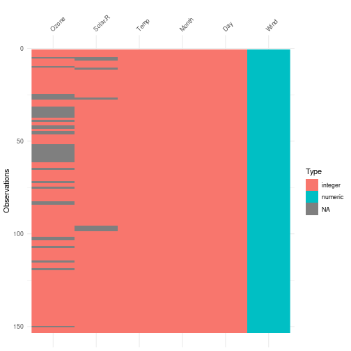
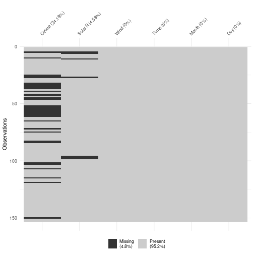
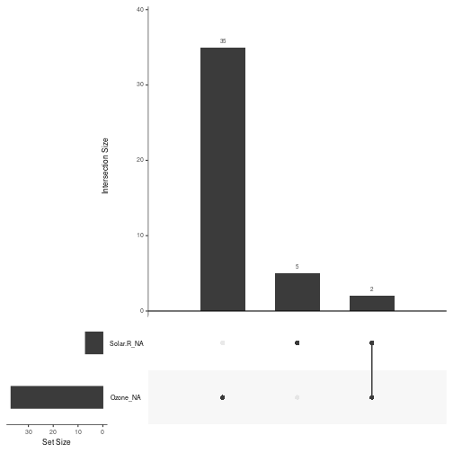
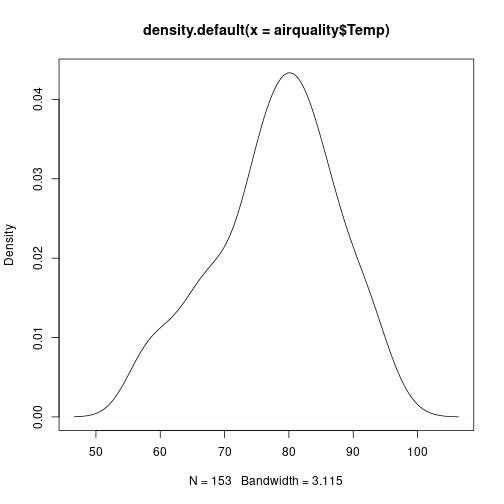
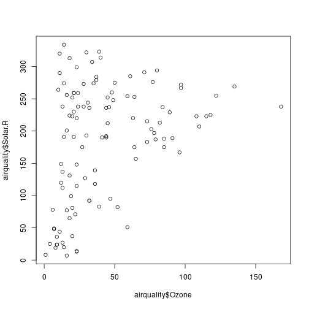
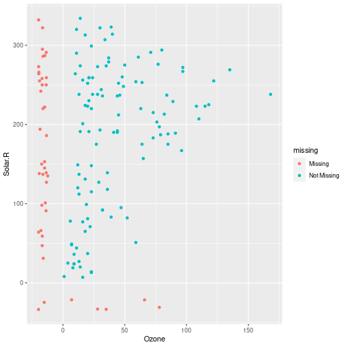
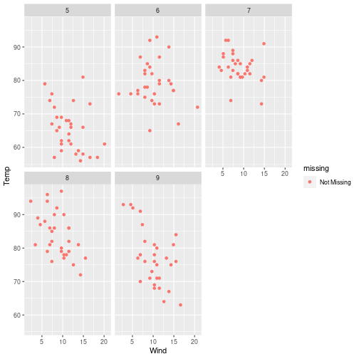
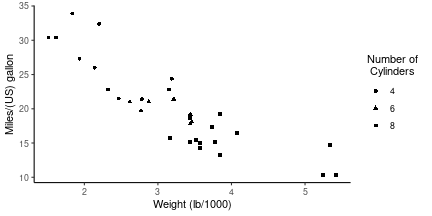

# Introduction

Research idea:

-   

Context: An organization membership located in Portugal. The organization offers
an annual membership for the members, the service subscription has several
payment options:

-   Men with a annual fee of 10€
-   Women annual fee of 6€
-   Correspondent fee 6€
-   Retired fee 5€
-   Student fee 2.5€
-   under-14 fee 1€

\clearpage

\renewcommand{\baselinestretch}{0.5}\normalsize

\renewcommand{\baselinestretch}{1.1}\normalsize

\clearpage


```r
library(dplyr)
library(dlookr)
library(ggplot2)

#eda_report(nlswork,output_dir  = 
#	"C:/Users/mangelo.EEG/Documents/GitHub/prjs/reports/",
#	output_file = "eda_report.pdf")

## The data

names(airquality)
```

```
## [1] "Ozone"   "Solar.R" "Wind"    "Temp"    "Month"   "Day"
```

```r
#summary(nlswork)

## Missing values
library(visdat)
vis_dat(airquality)
```



```r
library(naniar)
vis_miss(airquality)
```



```r
gg_miss_upset(airquality)
```



```r
## GRAPHS
dplyr::glimpse(cars$Ozone)
```

```
##  NULL
```

```r
d <- density(airquality$Temp)
plot(d)
```



```r
plot(airquality$Ozone, airquality$Solar.R)
```



```r
ggplot(airquality, aes(x = Ozone, y = Solar.R)) +
geom_miss_point()
```



```r
ggplot(airquality, aes(x = Wind, y = Temp)) +
geom_miss_point() +
facet_wrap(vars(Month))
```



```r
stats <- summary(airquality$Temp)
stats
```

```
##    Min. 1st Qu.  Median    Mean 3rd Qu.    Max. 
##   56.00   72.00   79.00   77.88   85.00   97.00
```

```r
describe(airquality)
```

```
## # A tibble: 6 × 26
##   variable     n    na   mean    sd se_mean   IQR skewness kurtosis   p00
##   <chr>    <int> <int>  <dbl> <dbl>   <dbl> <dbl>    <dbl>    <dbl> <dbl>
## 1 Ozone      116    37  42.1  33.0    3.06   45.2  1.24       1.29    1  
## 2 Solar.R    146     7 186.   90.1    7.45  143   -0.428     -0.968   7  
## 3 Wind       153     0   9.96  3.52   0.285   4.1  0.348      0.111   1.7
## 4 Temp       153     0  77.9   9.47   0.765  13   -0.378     -0.404  56  
## 5 Month      153     0   6.99  1.42   0.115   2   -0.00239   -1.30    5  
## 6 Day        153     0  15.8   8.86   0.717  15    0.00265   -1.20    1  
## # … with 16 more variables: p01 <dbl>, p05 <dbl>, p10 <dbl>, p20 <dbl>,
## #   p25 <dbl>, p30 <dbl>, p40 <dbl>, p50 <dbl>, p60 <dbl>, p70 <dbl>,
## #   p75 <dbl>, p80 <dbl>, p90 <dbl>, p95 <dbl>, p99 <dbl>, p100 <dbl>
```

# Experimental Results

## Data description


```
##  [1] "Sócio"               "dataAdesao"          "ano"                
##  [4] "dataNascimento"      "idade"               "sexo"               
##  [7] "estadoCivil"         "categoria"           "quotaMensal"        
## [10] "profissao"           "codPostal"           "ultimaQuota"        
## [13] "ultimoPagamento"     "valorTotal"          "totalJogos"         
## [16] "jogosEpoca"          "diasUltimoPagamento" "mesesUP"            
## [19] "abandonou"           "anosSocio"           "idaEstadio"         
## [22] "escaloesTotalJogos"  "mes"
```

```
##  [1] "num_socio"                 "dt_inscription"           
##  [3] "year"                      "birth_date"               
##  [5] "age"                       "sex"                      
##  [7] "marital_status"            "category"                 
##  [9] "monthly_fee"               "occupation"               
## [11] "zip_code"                  "dt_last_invoice"          
## [13] "dt_last_payment"           "total_amount"             
## [15] "total_matches"             "season_matches"           
## [17] "days_since_last_payment"   "months_since_last_payment"
## [19] "dropout"                   "years_membership"         
## [21] "stadium_access"            "quart_stadium_entries"    
## [23] "inscription_month"
```

```
## tibble [25,316 × 14] (S3: tbl_df/tbl/data.frame)
##  $ year                     : num [1:25316] 1944 1944 1945 1945 1945 ...
##  $ age                      : num [1:25316] 83 88 73 97 97 91 88 95 88 78 ...
##  $ sex                      : chr [1:25316] "M" "M" "M" "M" ...
##  $ marital_status           : chr [1:25316] "casado" "solteiro" "nao definido" "casado" ...
##  $ monthly_fee              : num [1:25316] 10 10 10 5 10 5 5 5 10 10 ...
##  $ total_amount             : num [1:25316] 1906 1906 1553 790 1466 ...
##  $ total_matches            : num [1:25316] 0 0 0 0 0 20 74 0 154 0 ...
##  $ season_matches           : num [1:25316] 0 0 0 0 0 0 0 0 6 0 ...
##  $ months_since_last_payment: num [1:25316] 3 3 36 8 35 4 41 40 4 2 ...
##  $ dropout                  : num [1:25316] 0 0 1 0 1 0 1 1 0 0 ...
##  $ years_membership         : num [1:25316] 74 74 73 73 73 73 73 73 73 72 ...
##  $ stadium_access           : num [1:25316] 0 0 0 0 0 1 1 0 1 0 ...
##  $ quart_stadium_entries    : chr [1:25316] "ate 1" "ate 1" "ate 1" "ate 1" ...
##  $ inscription_month        : num [1:25316] 10 10 8 9 9 12 1 1 2 4 ...
```


Table \@ref(tab:tab1cars) shows data's summary statistics.[^1] `stargazer()` is
and excellent solution to export outputs.

[^1]: You can reference the table as \@ref(tab1cars).


Teste \@ref(tab:summarytable)

\begin{table}

\caption{\label{tab:summarytable}Summary statistics}
\centering
\begin{tabular}[t]{ll}
\toprule
Characteristic & N = 25,316\\
\midrule
year & 2,007 (11)\\
age & 27 (20)\\
sex & \\
\hspace{1em}F & 32\%\\
\hspace{1em}M & 68\%\\
\addlinespace
marital\_status & \\
\hspace{1em}casado & 20\%\\
\hspace{1em}nao definido & 30\%\\
\hspace{1em}outro & 2.0\%\\
\hspace{1em}solteiro & 48\%\\
\addlinespace
monthly\_fee & \\
\hspace{1em}0 & <0.1\%\\
\hspace{1em}1 & 32\%\\
\hspace{1em}2.5 & 28\%\\
\hspace{1em}5 & 3.4\%\\
\addlinespace
\hspace{1em}6 & 12\%\\
\hspace{1em}10 & 24\%\\
total\_amount & 316 (494)\\
total\_matches & 27 (46)\\
season\_matches & 2.2 (4.1)\\
\addlinespace
months\_since\_last\_payment & 19 (32)\\
dropout & 22\%\\
years\_membership & 11 (11)\\
stadium\_access & 40\%\\
quart\_stadium\_entries & \\
\addlinespace
\hspace{1em}1 a 21 & 10\%\\
\hspace{1em}21 a 56 & 9.8\%\\
\hspace{1em}56 a 105 & 10.0\%\\
\hspace{1em}ate 1 & 60\%\\
\hspace{1em}mais 105 & 10.0\%\\
\addlinespace
inscription\_month & 6.9 (3.4)\\
\bottomrule
\multicolumn{2}{l}{\rule{0pt}{1em}\textsuperscript{1} Mean (SD); \%}\\
\end{tabular}
\end{table}


```python
from pysurvival.utils.display import correlation_matrix
import pandas as pd
import numpy as np

col = ['sex','marital_status','quart_stadium_entries']

df_members = r.df_members #copy r dataframe to python

df_members = pd.get_dummies(df_members, columns=col,drop_first=True)

# Creating the time and event columns
time_column = 'years_membership'
event_column = 'dropout'

# Extracting the features
features = np.setdiff1d(df_members.columns, [time_column, event_column] ).tolist()


correlation_matrix(df_members, figure_size=(10,10), text_fontsize=6)
```

The average age in our data is 27.3.

# Tables {#sec:tables}

R Markdown PDF is now able to produce good tables with our output. For
`stargazer` the label is contained in the function, while for `kable` it's
contained in the chunk name.

## stargazer(): Summary and regression tables

Table \@ref(tab2) reports regression outputs. Name the models as you can refer
to their names in the text (M1, M2, M3).


```r
library(stargazer)
model1 <- lm(speed ~ dist, data = cars)
model2 <- lm(speed ~ dist, data = cars)
model3 <- lm(dist ~ speed, data = cars)
stargazer(model1, model2, model3,
          title = "Regression table with stargazer",
          label = "tab2",
          table.placement = "h",
          column.labels = c("M1", "M2", "M3"),
          model.numbers = FALSE,
          header = FALSE)
```


\begin{table}[h] \centering 
  \caption{Regression table with stargazer} 
  \label{tab2} 
\begin{tabular}{@{\extracolsep{5pt}}lccc} 
\\[-1.8ex]\hline 
\hline \\[-1.8ex] 
 & \multicolumn{3}{c}{\textit{Dependent variable:}} \\ 
\cline{2-4} 
\\[-1.8ex] & \multicolumn{2}{c}{speed} & dist \\ 
 & M1 & M2 & M3 \\ 
\hline \\[-1.8ex] 
 dist & 0.166$^{***}$ & 0.166$^{***}$ &  \\ 
  & (0.017) & (0.017) &  \\ 
  & & & \\ 
 speed &  &  & 3.932$^{***}$ \\ 
  &  &  & (0.416) \\ 
  & & & \\ 
 Constant & 8.284$^{***}$ & 8.284$^{***}$ & $-$17.579$^{**}$ \\ 
  & (0.874) & (0.874) & (6.758) \\ 
  & & & \\ 
\hline \\[-1.8ex] 
Observations & 50 & 50 & 50 \\ 
R$^{2}$ & 0.651 & 0.651 & 0.651 \\ 
Adjusted R$^{2}$ & 0.644 & 0.644 & 0.644 \\ 
Residual Std. Error (df = 48) & 3.156 & 3.156 & 15.380 \\ 
F Statistic (df = 1; 48) & 89.567$^{***}$ & 89.567$^{***}$ & 89.567$^{***}$ \\ 
\hline 
\hline \\[-1.8ex] 
\textit{Note:}  & \multicolumn{3}{r}{$^{*}$p$<$0.1; $^{**}$p$<$0.05; $^{***}$p$<$0.01} \\ 
\end{tabular} 
\end{table} 

# Figures

## Graphs with R

You can insert figures like this. One would like to produce and insert them on
the fly in the `.rmd` file. Figure \@ref(fig:fig-1) is such an example.


```r
plot(cars$speed, cars$dist)
```


However, in some cases it does not work.

## Example: ggplot2 graphs

See the `ggplot2` output reported in Figure \@ref(fig:fig-2).


```r
mtcars$cyl <- as.factor(mtcars$cyl) # Convert cyl to factor
library(ggplot2)
ggplot(mtcars, aes(x = wt, y = mpg, shape = cyl)) + geom_point() +
  labs(x = "Weight (lb/1000)", y = "Miles/(US) gallon",
       shape = "Number of \n Cylinders") + theme_classic()
```



## Another example using Plotly

With `Plotly` we can produce interactive graphs which play well, for example,
once can embedded in html webpages (drop by
[here](https://paulcbauer.shinyapps.io/visualizing-causal-scenarios/) for an
example). One can insert this type of graphs in R Markdown PDF using `Orca` (it
generates static images from Plotly graphs). Go
[here](https://github.com/plotly/orca#installation) to check how to install it.
See Figure \@ref(fig:fig-3) for an example.


```r
library(plotly)
p <- plot_ly(cars, type = "scatter", mode = "markers",
        x = ~speed,
        y = ~dist)
#Sys.setenv('MAPBOX_TOKEN' = '12423423') # set arbitrary token
#orca(p, "logs/plotly-plot.pdf")
```

```{=tex}
\begin{figure}[ht]
\centering
\caption{Example: export a Plotly figure using `orca`}\label{fig:fig-3}
    \includegraphics[width = 0.9\linewidth]{../figures/teste.png}
\begin{flushleft}
\end{flushleft}
\end{figure}
\vspace{-1.2cm}
```

```r
# Lets create a value for example

media <- mean(cars$speed)
```

The criminal rate is 15.4%o.

\vspace{0.3cm}

# Miguel's tests

## R

Example of an equation

$$\int_0^{2\pi} \sin x~dx$$

*Example of a matrix*

$$
\mathbf{X} = \left[\begin{array}
{rrr}
1 & 2 & 3 \\
4 & 5 & 6 \\
7 & 8 & 9
\end{array}\right]
$$

or

```{=tex}
\begin{equation}
f\left(k\right) = \binom{n}{k}p^k\left(1-p\right)^{n-k} \label{eq:binom}
\end{equation}
```
See Equation \@ref(eq:binom).

```{=tex}
\begin{align}
y_{ijt} = \beta x_{ijt} + \eta_i + \gamma_j + \lambda_t + \varepsilon_{ijt}
\end{align}
```

```r
library(stargazer)
stargazer(cars,
          title = "Summary 24",
          label = "tab24",
          table.placement = "ht",
          header = FALSE)
```


\begin{table}[ht] \centering 
  \caption{Summary 24} 
  \label{tab24} 
\begin{tabular}{@{\extracolsep{5pt}}lccccccc} 
\\[-1.8ex]\hline 
\hline \\[-1.8ex] 
Statistic & \multicolumn{1}{c}{N} & \multicolumn{1}{c}{Mean} & \multicolumn{1}{c}{St. Dev.} & \multicolumn{1}{c}{Min} & \multicolumn{1}{c}{Pctl(25)} & \multicolumn{1}{c}{Pctl(75)} & \multicolumn{1}{c}{Max} \\ 
\hline \\[-1.8ex] 
speed & 50 & 15.400 & 5.288 & 4 & 12 & 19 & 25 \\ 
dist & 50 & 42.980 & 25.769 & 2 & 26 & 56 & 120 \\ 
\hline \\[-1.8ex] 
\end{tabular} 
\end{table} 

# Final remarks

Check the replication package for Bonhomme, Lamadon and Manresa (2019):
<https://github.com/tlamadon/blm-replicate>

\newpage

# References {.unnumbered}

::: {#refs}
:::

# Appendix: Chunk options {.unnumbered}

## Software versioning

### R


```r
cat(paste("#", capture.output(sessionInfo()), "\n", collapse  = ""))
```

```
## # R version 4.1.0 (2021-05-18) 
## # Platform: x86_64-pc-linux-gnu (64-bit) 
## # Running under: Ubuntu 20.04.2 LTS 
## #  
## # Matrix products: default 
## # BLAS:   /usr/lib/x86_64-linux-gnu/openblas-pthread/libblas.so.3 
## # LAPACK: /home/sobreiro/miniconda3/envs/survival/lib/libmkl_intel_lp64.so 
## #  
## # locale: 
## # [1] en_US.UTF8 
## #  
## # attached base packages: 
## # [1] stats     graphics  grDevices utils     datasets  methods   base      
## #  
## # other attached packages: 
## #  [1] knitr_1.33       plotly_4.9.4.1   kableExtra_1.3.4 gtsummary_1.4.2  
## #  [5] readxl_1.3.1     stargazer_5.2.2  naniar_0.6.1     visdat_0.5.3     
## #  [9] ggplot2_3.3.5    dlookr_0.4.5     dplyr_1.0.7      rmarkdown_2.9    
## # [13] nvimcom_0.9-115  
## #  
## # loaded via a namespace (and not attached): 
## #   [1] colorspace_2.0-2    ellipsis_0.3.2      class_7.3-19        
## #   [4] rio_0.5.27          htmlTable_2.2.1     base64enc_0.1-3     
## #   [7] rstudioapi_0.13     proxy_0.4-26        farver_2.1.0        
## #  [10] fansi_0.5.0         mvtnorm_1.1-2       xml2_1.3.2          
## #  [13] splines_4.1.0       extrafont_0.17      libcoin_1.0-8       
## #  [16] Formula_1.2-4       jsonlite_1.7.2      gt_0.3.0            
## #  [19] Rttf2pt1_1.3.8      cluster_2.1.2       png_0.1-7           
## #  [22] compiler_4.1.0      httr_1.4.2          backports_1.2.1     
## #  [25] lazyeval_0.2.2      assertthat_0.2.1    Matrix_1.3-4        
## #  [28] cli_3.0.1           hrbrthemes_0.8.0    htmltools_0.5.1.1   
## #  [31] tools_4.1.0         partykit_1.2-13     gtable_0.3.0        
## #  [34] glue_1.4.2          tinytex_0.32        Rcpp_1.0.7          
## #  [37] carData_3.0-4       cellranger_1.1.0    vctrs_0.3.8         
## #  [40] svglite_2.0.0       extrafontdb_1.0     crosstalk_1.1.1     
## #  [43] broom.helpers_1.3.0 inum_1.0-4          xfun_0.24           
## #  [46] stringr_1.4.0       openxlsx_4.2.4      rvest_1.0.0         
## #  [49] lifecycle_1.0.0     RcmdrMisc_2.7-1     MASS_7.3-54         
## #  [52] zoo_1.8-9           scales_1.1.1        hms_1.1.0           
## #  [55] sandwich_3.0-1      RColorBrewer_1.1-2  yaml_2.2.1          
## #  [58] curl_4.3.2          reticulate_1.20     gridExtra_2.3       
## #  [61] UpSetR_1.4.0        gdtools_0.2.3       rpart_4.1-15        
## #  [64] latticeExtra_0.6-29 stringi_1.7.3       highr_0.9           
## #  [67] corrplot_0.90       nortest_1.0-4       e1071_1.7-7         
## #  [70] checkmate_2.0.0     zip_2.2.0           rlang_0.4.11        
## #  [73] pkgconfig_2.0.3     systemfonts_1.0.2   evaluate_0.14       
## #  [76] lattice_0.20-44     purrr_0.3.4         htmlwidgets_1.5.3   
## #  [79] labeling_0.4.2      tidyselect_1.1.1    bookdown_0.22       
## #  [82] plyr_1.8.6          magrittr_2.0.1      R6_2.5.0            
## #  [85] generics_0.1.0      Hmisc_4.5-0         DBI_1.1.1           
## #  [88] pillar_1.6.1        haven_2.4.1         foreign_0.8-81      
## #  [91] withr_2.4.2         prettydoc_0.4.1     survival_3.2-11     
## #  [94] abind_1.4-5         nnet_7.3-16         tibble_3.1.3        
## #  [97] crayon_1.4.1        car_3.0-11          utf8_1.2.1          
## # [100] jpeg_0.1-8.1        grid_4.1.0          data.table_1.14.0   
## # [103] forcats_0.5.1       digest_0.6.27       webshot_0.5.2       
## # [106] tidyr_1.1.3         munsell_0.5.0       viridisLite_0.4.0
```

```r
  # or use message() instead of cat()
```
